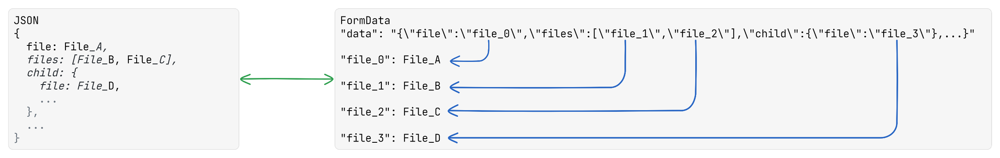

# Form Json

Support upload files with JSON data.

## How It Works

It will help you to convert JSON data to FormData to send request on client side and convert Form Data to origin data on server side. The following image shows you how it works.

## Support Platforms

- [ASP.NET - C#](./aspnet/)
- [Spring - Java](./spring/)
- [Node - JS, TS](./node/)
- [Dio - Dart](./dio/)
